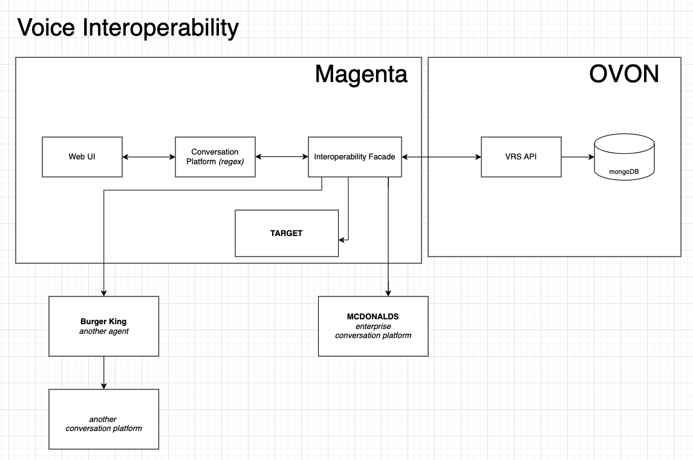
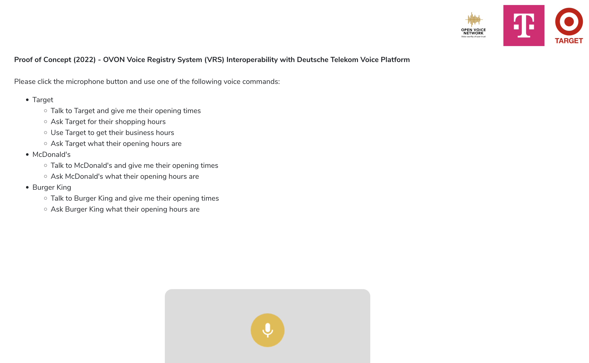
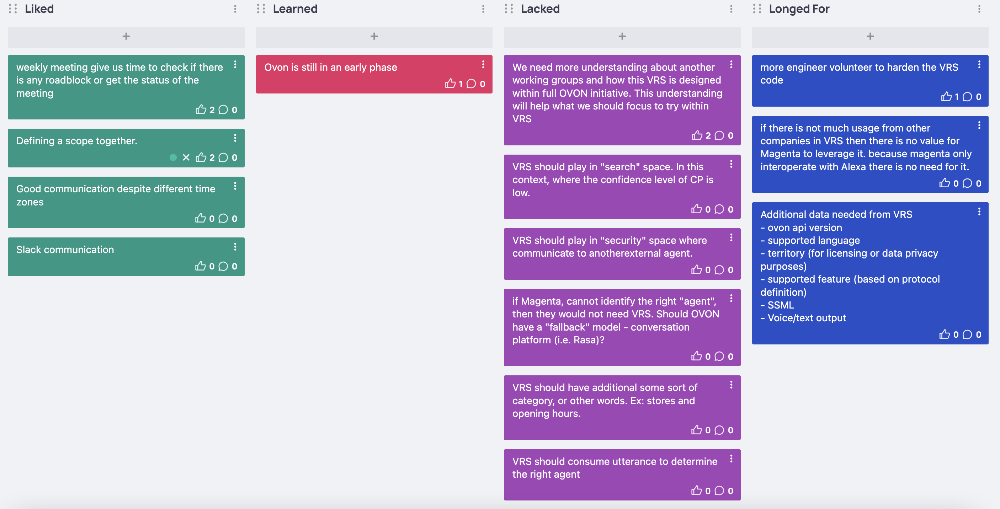

# vrs-magenta-poc-phase1

## __OVERVIEW__
The VRS-Magenta had a POC to understand the value of VRS for them. Phase 1 covers two use-cases

 (1) a skill that resides in Magenta 

 (2) a skill that resides with other agents

The scope of both use-cases is "explicit utterance," which means the conversation platform identifies the intent and passes it to VRS.

## __POC_DIAGRAM__

## __POC_UI__

See [actual demo](https://voice-apps.voiceui.telekom.net/b2b-poc/ovon-vrs-poc/ui/)

## __RETRO_DISCUSSION__
We did a retro about two things:
1. POC process
2. VRS Interoperability

See [retro board](https://easyretro.io/publicboard/ZX8hMUPtcDdDyLeFLvf9LaE5RNv2/e0fd2daa-2b22-4ab5-877d-cb7f8c53ed6e)

## __SUMMARY__

**POC Process**
- Defining the scope together and timeline works great. Both groups collaborated well and understood what we needed to deliver under a month. 
- Team communication is defined (meeting weekly), and slack communication helps in a real-time road-block.
- Delivered the POC a week earlier.

**VRS Interoperability**
- The Magenta tech team is confused with the whole OVON initiative and needs understanding with another working group.
- Passing to another agent is a use case that came about as another opportunity for VRS, and this would require VRS to hold some security tokens so the conversation platform caller can facilitate the transfer securely. 
- A significant percentage (~90) of voice conversation is "implicit" requests. How do we handle "interoperability" in this situation?

## __NEXT_STEP__
- A discussion around "implicit request." *Does OVON needs to play in a search-engine (low-confidence) model?*
- VRS integration with open-source conversation platform
- VRS needs to add more security context when passing to another agent
- Get more engineers 
- VRS and Architecture grouP